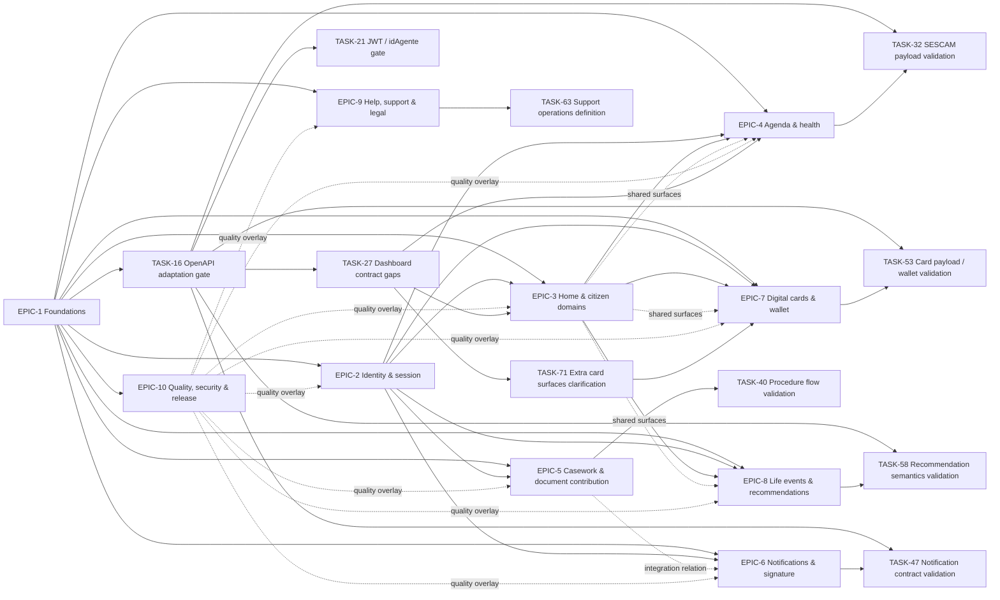
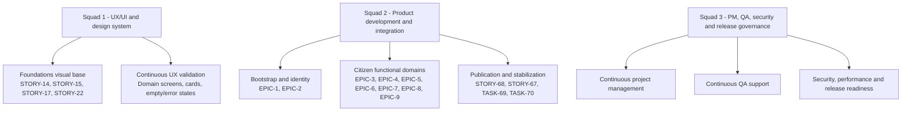
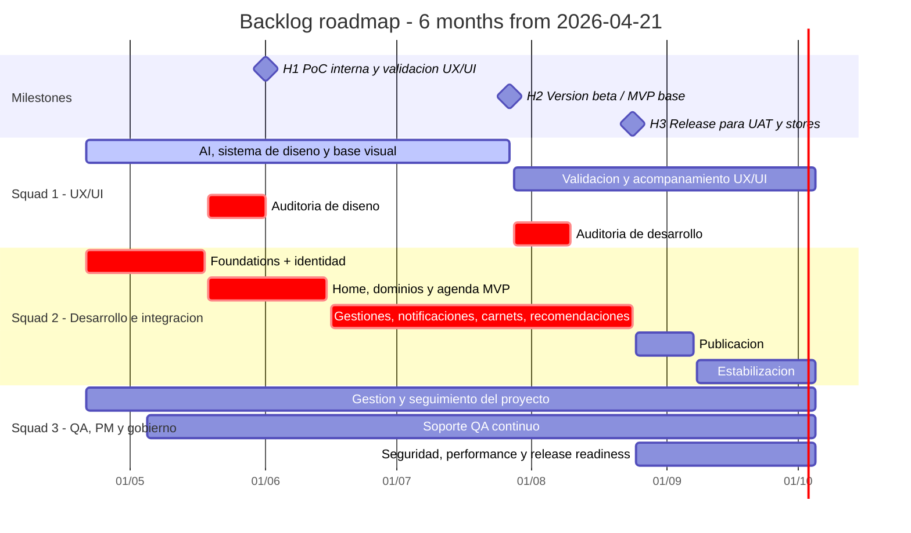

# Backlog review, ticket readiness, and roadmap

**Review date:** 2026-04-21  
**Scope reviewed:** `tickets/` (70 ticket files + `README.md`)  
**Roadmap reference:** `documentation/plan_inicial.png`, adjusted to the real calendar starting on 2026-04-21 with 2-week sprints except July and August, which run as 4-week sprints.

## Executive outcome

The backlog is now **structurally sound, traceable, and ready to enter development**. The review covered all 70 ticket files and confirmed:

| Check | Result | Notes |
| --- | --- | --- |
| Canonical filename by `type + id` | Pass | 70/70 tickets comply |
| Mandatory frontmatter and section order | Pass | No missing sections |
| One real file per ticket | Pass | No inline pseudo-subtasks |
| Acceptance criteria present | Pass | 10 epics with 3 criteria, 60 child tickets with 4 criteria |
| Traceability present | Pass | Documents, contracts, and visual references are linked in-ticket |
| Dependency mapping present | Pass | One inconsistency found and corrected in `TASK-71` |
| Orphan ticket detection | Pass | No orphan tickets detected |

**Review action completed:** `TASK-71` was normalized so dependency references are now bracketed and machine-readable like the rest of the backlog.

**Operational note:** `priority`, `sprint`, `story_points`, `assignee`, and `jira_key` remain blank across tickets because there is no authoritative tracker source for those fields. This report provides the execution sequence and roadmap without inventing external metadata.

## Portfolio snapshot

| Metric | Value |
| --- | ---: |
| Epics | 10 |
| Stories | 48 |
| Tasks | 12 |
| Subtasks | 0 |
| Total tickets | 70 |
| Cross-epic discovery gates | 2 (`TASK-27`, `TASK-71`) |
| Domain discovery / contract validation tasks | 10 |
| Hardening tasks | 2 (`TASK-69`, `TASK-70`) |

## Relationship architecture

### Epic dependency view

### Delivery lanes derived from the execution plan image

## Development readiness assessment

The backlog is **development-ready because every known ambiguity has already been isolated as an explicit ticket**, instead of being hidden inside broader stories. The practical execution posture is:

| Readiness class | Meaning | Tickets |
| --- | --- | --- |
| Ready now | Can start immediately with no unresolved product ambiguity | `EPIC-1`, `STORY-17`, `STORY-59`, `STORY-61`, `STORY-62`, `STORY-64`, `STORY-68`, `TASK-69` |
| Ready with planned upstream foundations | Depends on `EPIC-1` or `EPIC-2`, but scope is already clear | Most stories in `EPIC-3` to `EPIC-9` |
| Discovery-gated but still ready for execution | Has an explicit validation or contract task that must run first or in parallel | `TASK-16`, `TASK-21`, `TASK-27`, `TASK-32`, `TASK-40`, `TASK-47`, `TASK-53`, `TASK-58`, `TASK-63`, `TASK-71` |
| Hardening / exit quality | Runs once the main product slices exist | `STORY-65`, `STORY-66`, `STORY-67`, `STORY-68`, `TASK-69`, `TASK-70` |

## Traceability by domain

| Epic | Main documentary anchors | Main visual anchors |
| --- | --- | --- |
| `EPIC-1` | `.github/copilot-instructions.md`, architecture canon index + annexes | Base application structure is inferred from canon rather than UI screenshots |
| `EPIC-2` | `DOCUMENTO_COMPRENSION_FUNCIONAL.md`, planning docs | Landing, login, consent, menu, maintenance screens |
| `EPIC-3` | `DOCUMENTO_COMPRENSION_FUNCIONAL.md`, endpoint mapping docs, PPT summary | Logged home, domain landings, dashboard widgets, quick actions |
| `EPIC-4` | Functional doc, endpoint mapping, generated SESCAM APIs | Agenda, appointment details, CIP and health blocks |
| `EPIC-5` | Functional doc, endpoint mapping, generated procedure APIs | Mis gestiones, expediente detail, aportacion wizard, attachments |
| `EPIC-6` | Functional doc, endpoint mapping, notification contract docs | Notification list, pending decision, rejection confirmation, signature flow |
| `EPIC-7` | Functional doc, generated card APIs | Digital cards, QR/PDF/PKPass, unavailable states |
| `EPIC-8` | Functional doc, generated recommendation APIs | Life-event preferences, empty onboarding, grouped recommendations |
| `EPIC-9` | Functional doc, PPT summary | Help center, technical support form, legal footer, sitemap |
| `EPIC-10` | Architecture canon annexes C-D, planning phases | Quality is mostly documentary and cross-cutting rather than screen-specific |

## Epic-by-epic ticket review

### EPIC-1 - Foundations, app shell y arquitectura base

**Entry gate:** none  
**Blocks:** every downstream epic

| Ticket | Role in development | Main relationship | Roadmap slot |
| --- | --- | --- | --- |
| `STORY-11` | Define repo topology, app bootstrap and environment entrypoints | Starts first and blocks `STORY-12`, `STORY-13`, `STORY-14` | S1 |
| `STORY-12` | Shared networking, secure storage and error strategy | Follows `STORY-11`; enables API-backed work and `TASK-16` | S1 |
| `STORY-13` | Global shell, router, guards and deep links | Depends on `STORY-11`; enables anonymous/logged navigation | S1-S2 |
| `STORY-14` | Design system, theme, l10n and accessibility baseline | Depends on `STORY-11`; feeds every UI ticket | S1-S2 |
| `STORY-15` | Shared loading, empty, error, pagination and document actions | Built on top of shell + design system for reuse by all domains | S2 |
| `TASK-16` | Lock the OpenAPI adaptation and DTO encapsulation strategy | Discovery gate for `TASK-21`, `TASK-27`, `TASK-32`, `TASK-47`, `TASK-53`, `TASK-58` | S1-S2 |

### EPIC-2 - Identidad, sesion y consentimiento del ciudadano

**Entry gate:** `EPIC-1`  
**Blocks:** every authenticated feature epic

| Ticket | Role in development | Main relationship | Roadmap slot |
| --- | --- | --- | --- |
| `STORY-17` | Public landing and pre-access information architecture | Can progress early with `STORY-13` and `STORY-14` | S1 |
| `STORY-18` | Cl@ve login, callback and session lifecycle | Depends on shell/networking and `TASK-21` findings | S1-S2 |
| `STORY-19` | Initial legal consent and data-usage acceptance | Couples legal content with first-login state | S1-S2 |
| `STORY-20` | Logged user state, personal menu and maintenance blockade | Depends on session and shell; gates logged-home access | S2 |
| `TASK-21` | Validate JWT claims, `idAgente` and federation parameters | Must close before final auth/session integration | S1-S2 |

### EPIC-3 - Portada, dashboard y dominios informativos del ciudadano

**Entry gate:** `EPIC-1`, `EPIC-2`  
**Cross-epic gates:** `TASK-27`, `TASK-71`

| Ticket | Role in development | Main relationship | Roadmap slot |
| --- | --- | --- | --- |
| `STORY-22` | Logged home with citizen summary and quick actions | Depends on identity state; impacted by `TASK-71` for extra card surfaces | S2-S3 |
| `STORY-23` | Education landing, titles and related links | Blocked by `TASK-27` for scholarship-related ambiguity | S3 |
| `STORY-24` | Employment landing, status and job-application surfaces | Blocked by `TASK-27` for offer inscription ambiguity | S3 |
| `STORY-25` | Social care landing with large-family and related services | Blocked by `TASK-27` for parking/dependency/termalism decisions | S3-S4 |
| `STORY-26` | State and other-interest domain with domicile, vehicles and real estate | Functionally clear once home routing exists | S3 |
| `STORY-28` | External-link handling and outbound domain navigation | Parallel support slice for `STORY-23` to `STORY-26` | S3 |
| `TASK-27` | Validate visible dashboard blocks that lack a confirmed contract | Cross-epic decision gate for `STORY-23`, `STORY-24`, `STORY-25`, `STORY-31` | S3 |
| `TASK-71` | Clarify extra card surfaces shown on home | Follows `TASK-27`; affects `STORY-22`, `STORY-31`, `STORY-48` | S4 |

### EPIC-4 - Agenda y servicios de salud del ciudadano

**Entry gate:** `EPIC-1`, `EPIC-2`  
**Shared dependency:** home/dashboard health surfaces from `EPIC-3`

| Ticket | Role in development | Main relationship | Roadmap slot |
| --- | --- | --- | --- |
| `STORY-29` | Agenda list, calendar and time filters | Starts the health slice once auth and shell exist | S3-S4 |
| `STORY-30` | Appointment detail, supporting receipt and state handling | Builds on `STORY-29` list entry points | S4 |
| `STORY-31` | Reusable CIP and health surfaces across home and agenda | Depends on `TASK-27`; impacted by `TASK-71` when extra health cards are confirmed | S4 |
| `TASK-32` | Validate real SESCAM payload format and parsing rules | Must finish before finalizing adapters and resilient health UX | S4 |

### EPIC-5 - Gestiones, expedientes y aportacion documental

**Entry gate:** `EPIC-1`, `EPIC-2`  
**Integration relation:** shares evidence and document concerns with `EPIC-6`

| Ticket | Role in development | Main relationship | Roadmap slot |
| --- | --- | --- | --- |
| `STORY-34` | Main workspace for expedientes, entradas and salidas | Functional shell for the whole casework domain | S4 |
| `STORY-35` | Expediente detail with metadata and files | Builds on `STORY-34` and `TASK-40` findings | S5 |
| `STORY-36` | Entry/exit register detail | Builds on `STORY-34` and validated record semantics | S5 |
| `STORY-37` | Dedicated third-party document contribution flow | Depends on procedure validation and upload primitives | S5 |
| `STORY-38` | Attachment upload, hashing, validation and receipt download | Technical core for contribution and document evidence | S5-S6 |
| `STORY-39` | Search by identification, expediente number or registry number | Alternative access path to the same casework domain | S4 |
| `TASK-40` | Validate the complete procedure and evidence flow | Discovery gate before closing expedition and aportacion behavior | S4-S5 |

### EPIC-6 - Notificaciones administrativas y firma digital

**Entry gate:** `EPIC-1`, `EPIC-2`  
**Integration relation:** shared document/evidence flow with `EPIC-5`

| Ticket | Role in development | Main relationship | Roadmap slot |
| --- | --- | --- | --- |
| `STORY-41` | Notification center with state filters and pagination | Base list surface for the domain | S5 |
| `STORY-42` | Contact-data registration for the electronic notification platform | Prerequisite for citizens without configured channel data | S5 |
| `STORY-43` | Pending notification decision with accept/reject flow | Depends on `STORY-41`, `STORY-42`, `TASK-47` | S6 |
| `STORY-44` | Accepted/rejected/expired notification detail with documents | Depends on validated contract and list entry points | S6 |
| `STORY-45` | Documents-to-sign list, certificate validation and signed history | Prepares the signature workbench | S6 |
| `STORY-46` | Browser jump to Afirma and secure app return | Depends on `STORY-45` and mobile deep-link handling | S6 |
| `TASK-47` | Confirm real notification contract and document association | Discovery gate before finalizing notification states and document detail | S5 |

### EPIC-7 - Carnets digitales, wallet y documentos acreditativos

**Entry gate:** `EPIC-1`, `EPIC-2`  
**Shared relation:** dashboard/home and health card surfaces from `EPIC-3` and `EPIC-4`

| Ticket | Role in development | Main relationship | Roadmap slot |
| --- | --- | --- | --- |
| `STORY-48` | Digital card catalogue with availability and blocked states | Depends on `TASK-53`; impacted by `TASK-71` for extra home surfaces | S4-S5 |
| `STORY-49` | Large-family digital card and its exports | Builds on catalogue + shared export layer | S6 |
| `STORY-50` | Youth card detail modal and mobile formats | Builds on catalogue + shared export layer | S6 |
| `STORY-51` | Disability card, degree data and non-valid state | Builds on catalogue + shared export layer | S6 |
| `STORY-52` | Shared QR, PDF, PKPass and wallet handling | Technical enabler for every concrete card story | S5-S6 |
| `TASK-53` | Validate binary/string card payloads and wallet rules | Mandatory contract gate before implementing final document export behavior | S5 |

### EPIC-8 - Hechos vitales, autorizaciones y recomendaciones personalizadas

**Entry gate:** `EPIC-1`, `EPIC-2`  
**Shared relation:** home personalization and dashboard recommendation visibility

| Ticket | Role in development | Main relationship | Roadmap slot |
| --- | --- | --- | --- |
| `STORY-54` | Citizen life-event selection and persistence | First domain slice; independent of recommendation rendering | S4 |
| `STORY-55` | Data-use permissions and revocation from preferences | Couples legal consent with personalization control | S4 |
| `STORY-56` | Personalized recommendations with filters and grouping | Depends on `STORY-54`, `STORY-55`, `TASK-58` | S6 |
| `STORY-57` | Recommendation empty state and onboarding when data is missing | Parallel UX slice to `STORY-56`; depends on the same semantics | S6 |
| `TASK-58` | Confirm segmentation rules and semantic contract for recommendations | Discovery gate before final recommendation implementation | S6 |

### EPIC-9 - Ayuda, soporte y contenidos legales

**Entry gate:** `EPIC-1`, `EPIC-2`  
**Shared relation:** footer and static navigation from `EPIC-3`

| Ticket | Role in development | Main relationship | Roadmap slot |
| --- | --- | --- | --- |
| `STORY-59` | Help center with FAQ, guides and informative contact | Can start early once shell and typography exist | S2 |
| `STORY-60` | Technical support form with attachments, consent and captcha | Depends on `TASK-63` for backend/ops definition | S4-S7 |
| `STORY-61` | Legal and static pages: terms, privacy, accessibility, notice | Supports onboarding, footer and compliance flows | S2 |
| `STORY-62` | Sitemap and global footer navigation | Builds on shell + legal/static content | S2 |
| `TASK-63` | Define support integration and incident escalation model | Discovery gate for `STORY-60` and support operations | S7 |

### EPIC-10 - Calidad transversal, seguridad, observabilidad y release readiness

**Entry gate:** `EPIC-1`  
**Execution mode:** cross-cutting, from first sprint to release closure

| Ticket | Role in development | Main relationship | Roadmap slot |
| --- | --- | --- | --- |
| `STORY-64` | Observability, analytics and PII-redacted logging | Starts early and overlays all feature epics | S1-S10 |
| `STORY-65` | Cache, offline, connectivity, retry and resilience | Becomes meaningful once feature data flows exist | S7-S9 |
| `STORY-66` | Test pyramid, contract tests and generated-client validation | Starts once foundations and first integrations exist | S5-S9 |
| `STORY-67` | Functional QA, accessibility and visual regression before handoff | Concentrates after main integration, but preparation starts earlier | S7-S10 |
| `STORY-68` | CI/CD, codegen verification, environment pipeline and release checklist | Starts early, closes late | S2-S10 |
| `TASK-69` | PII inventory, security hardening and architecture exception ADRs | Starts early and closes in release hardening | S1-S9 |
| `TASK-70` | Performance budgets for startup, lists and documents | Runs when representative flows are available | S7-S9 |

## Issue register from the review

| ID | Status | Finding | Impact | Resolution |
| --- | --- | --- | --- | --- |
| `AUD-01` | Closed | `TASK-71` had dependency references without bracket normalization | Low, but affected consistency and machine readability | Fixed during this review and `updated_at` was refreshed |
| `AUD-02` | Accepted / non-blocking | Tracker-owned fields (`priority`, `sprint`, `story_points`, `assignee`, `jira_key`) are empty in all tickets | Low; does not block dev because execution sequence is defined here | Keep empty until a real tracker or delivery manager assigns them |
| `AUD-03` | Planned | 10 discovery/validation tasks remain necessary before some contracts are locked | Expected and already modeled | Scheduled explicitly in early roadmap waves |

## Sprint calendar

| Sprint | Dates | Length | Primary outcome |
| --- | --- | --- | --- |
| Sprint 1 | 2026-04-21 -> 2026-05-04 | 2 weeks | Foundations, bootstrap, shell base, public landing, security/observability baseline |
| Sprint 2 | 2026-05-05 -> 2026-05-18 | 2 weeks | Session closure, logged shell, legal/static surfaces, CI/CD baseline |
| Sprint 3 | 2026-05-19 -> 2026-06-01 | 2 weeks | Home/dashboard MVP, first domain slices, dashboard contract discovery |
| Sprint 4 | 2026-06-02 -> 2026-06-15 | 2 weeks | Agenda/CIP, casework shell, card catalogue, life-event baseline |
| Sprint 5 | 2026-06-16 -> 2026-06-29 | 2 weeks | Procedures, uploads, notification foundations, card contract validation |
| Sprint 6 | 2026-06-30 -> 2026-07-27 | 4 weeks | Main integration wave: notifications, signature, cards, recommendations |
| Sprint 7 | 2026-07-28 -> 2026-08-24 | 4 weeks | Support operations closure, resilience/testing ramp-up, UAT candidate stabilization |
| Sprint 8 | 2026-08-25 -> 2026-09-07 | 2 weeks | Publication readiness, UAT handoff, regression and release packaging |
| Sprint 9 | 2026-09-08 -> 2026-09-21 | 2 weeks | Security/performance stabilization and defect closure |
| Sprint 10 | 2026-09-22 -> 2026-10-05 | 2 weeks | Final release closure, contingency, store follow-through |

## Ticket roadmap by sprint

| Sprint | Planned tickets |
| --- | --- |
| Sprint 1 | `STORY-11`, `STORY-12`, `STORY-13`, `STORY-14`, `TASK-16`, `STORY-17`, `STORY-18`, `STORY-19`, `STORY-64`, `TASK-69` |
| Sprint 2 | `STORY-15`, `TASK-21`, `STORY-20`, `STORY-22`, `STORY-59`, `STORY-61`, `STORY-62`, `STORY-68` |
| Sprint 3 | `STORY-23`, `STORY-24`, `STORY-25`, `STORY-26`, `STORY-28`, `TASK-27`, `STORY-29` |
| Sprint 4 | `STORY-30`, `STORY-31`, `TASK-32`, `STORY-34`, `STORY-39`, `STORY-48`, `STORY-54`, `STORY-55`, `TASK-71`, `STORY-60` |
| Sprint 5 | `STORY-35`, `STORY-36`, `STORY-37`, `STORY-38`, `TASK-40`, `STORY-41`, `STORY-42`, `TASK-47`, `TASK-53`, `STORY-52` |
| Sprint 6 | `STORY-43`, `STORY-44`, `STORY-45`, `STORY-46`, `STORY-49`, `STORY-50`, `STORY-51`, `STORY-56`, `STORY-57`, `TASK-58` |
| Sprint 7 | `TASK-63`, `STORY-65`, `STORY-66`, `STORY-67`, `TASK-70`, plus closure of open findings from `TASK-40`, `TASK-47`, `TASK-53`, `TASK-58`, `TASK-71` |
| Sprint 8 | `STORY-68`, `STORY-67`, `STORY-64`, `STORY-65`, `TASK-69`, `TASK-70` with UAT and publication packaging |
| Sprint 9 | Defect closure, security hardening, performance tuning, resilience closure across all functional epics |
| Sprint 10 | Final release checklist, publication follow-through, stabilization reserve and controlled hotfix window |

## Milestones and gantt roadmap

## Final readiness conclusion

This review leaves the backlog in a **development-ready state**:

1. Every ticket file is structurally complete and follows the repository ticket canon.
2. Every known ambiguity is isolated in an explicit discovery or validation ticket instead of leaking into implementation stories.
3. Cross-ticket relationships are now traced at epic level and in the sprint roadmap.
4. The roadmap aligns with the provided 6-month execution model, including 4-week July and August sprints.
5. No known work item remains outside a real ticket or a real discovery gate.

The only ticket correction needed during the review was already applied to `TASK-71`, and there are **no remaining blocking quality issues in `tickets/`**.
